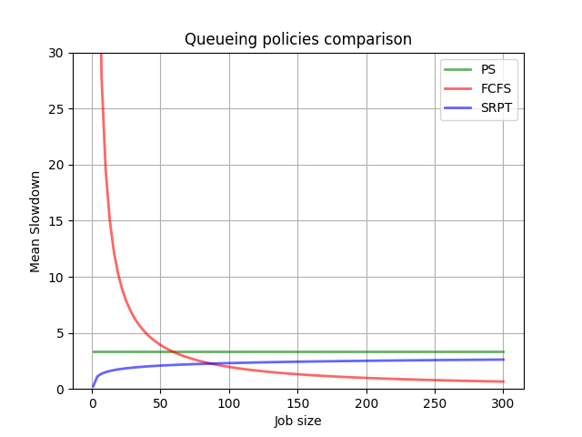

# Performance Slowdown Analysis

This repository contains the code and analysis for Assignment 2 of the course **Software Performance and Scalability [CM0481]**. The assignment focuses on studying and comparing the mean slowdown of various queuing disciplines including FCFS (First-Come-First-Serve, PS (Processor Sharing), and SRPT (Shortest Remaining Processing Time).

## Introduction
The goal of the project is to compare the mean slowdown of three queuing disciplines: FCFS, PS, and SRPT. Slowdown, defined as the delay normalized to the job size, is used for comparison. Default values for the Pareto distribution shaping the policies are provided.

## Final Considerations
### All-Can-Win Theory Definition
The All-Can-Win theory states that for an M/G/1 system, if $\rho<\frac{1}{2}$, then every job prefers SRPT to PS in expectation. This property holds until $\rho<0.96$.

### Plots Comparison
A comparison plot illustrates that SRPT consistently outperforms PS, validating the All-Can-Win theory. SRPT remains fair for all job sizes up to 400, with its performance consistently below PS.

### Conclusions
The analysis confirms SRPT's superiority over PS, aligning with theoretical predictions. The results uphold the All-Can-Win theory, even for $\rho=0.7$ and $\rho=0.5$, satisfying the specified requirements.

The conclusions drawn from the analysis are summarized. It is observed that SRPT remains a fair discipline for job sizes up to 400. The All-Can-Win theory holds true for the given conditions ($\rho=0.7$), and it's inferred that the property is valid for $\rho=0.5$ as well. 

## Usage
1. Clone the repository.
2. Run `plots.py` to generate the comparison plot.
4. Review the analysis and conclusions in the README.md file.

## Contributors
- Francesco Forcellato (875290)
- Gabriele Pilotto (902388)
- Pietro Visconti (885448)

## Academic Year
2023 / 2024

For more details, refer to the code and documentation provided in this repository.
